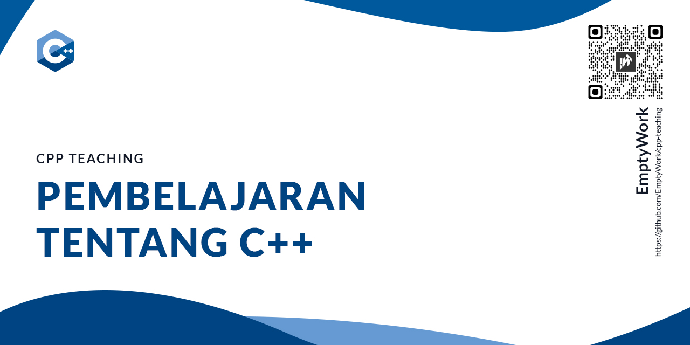

# Pembelajaran Tentang C++

Source code untuk dasar-dasar tentang bahasa pemrograman C++. Adapun materi yang termuat pada repository ini antara lain:
- <a href="src/1-pengenalan-awal-data-type.cpp">Pengenalan awal: Data-type [src/1-pengenalan-awal-data-type.cpp]</a>
- <a href="src/2-pengenalan-fungsi.cpp">Pengenalan fungsi [src/2-pengenalan-fungsi.cpp]</a>

## Daftar File dan File dengan Komen
|File|Komen File|
|---|---|
|<a href="src/1-pengenalan-awal-data-type.cpp">src/1-pengenalan-awal-data-type.cpp</a>|<a href="src/comment/1b-pengenalan-awal-data-type.cpp">src/comment/1b-pengenalan-awal-data-type.cpp</a>|
|<a href="src/2-pengenalan-fungsi.cpp">src/2-pengenalan-fungsi.cpp</a>|<a href="src/comment/2b-pengenalan-fungsi.cpp">src/comment/2b-pengenalan-fungsi.cpp</a>|

**Didukung oleh:**
<a href="https://filkom.ukim.ac.id">Filkom UKIM</a> | <a href="https://ukim.ac.id">UKIM</a>

## Rekomendasi Code Editor

**Visual Studio C++** : https://visualstudio.microsoft.com/vs/features/cplusplus/

**Visual Studio Code**: https://code.visualstudio.com/
 - **Visual Studio Code Linux**: https://code.visualstudio.com/docs/cpp/config-linux
 - **Visual Studio Code Windows**: https://code.visualstudio.com/docs/cpp/config-mingw

## Sumber

**Naming Convetion**: https://chaste.cs.ox.ac.uk/trac/raw-attachment/wiki/CodingStandardsStrategy/codingStandards.pdf

**CPPReference**: https://en.cppreference.com/w/

**CPlusPlus**: https://www.cplusplus.com/
